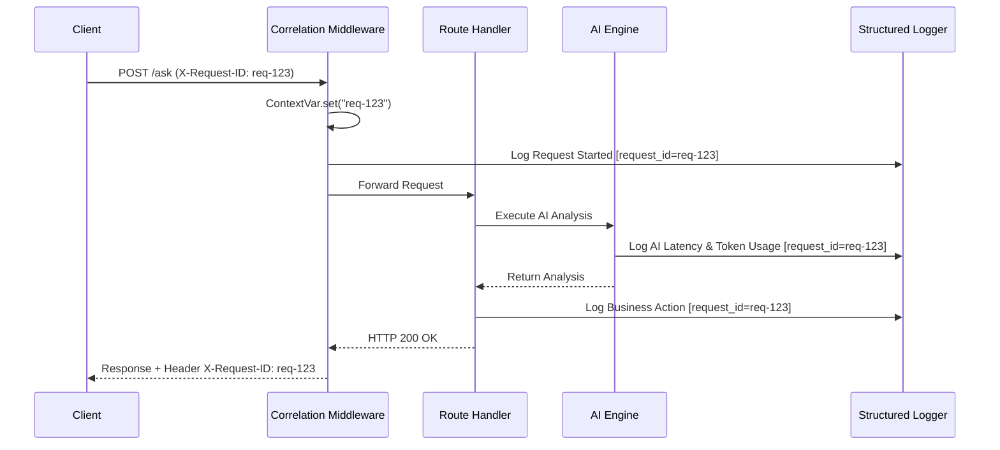
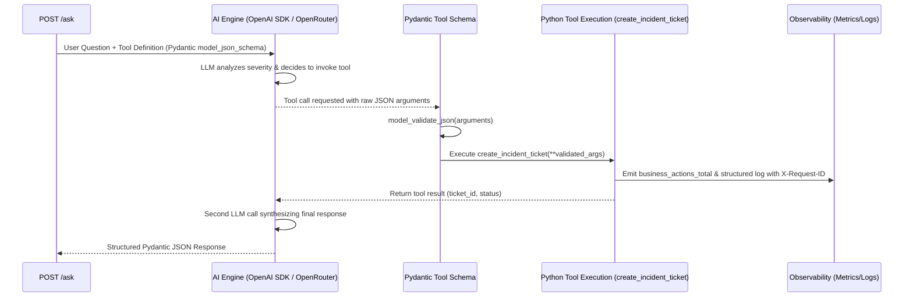

# DESIGN.md – Observable AI-Powered Backend Service

## 1. Executive Summary & System Architecture

This document outlines the architecture, design decisions, and observability strategy for the **Observable AI-Powered Backend Service** built for the **AI Platform Engineer – Observability Challenge**.

The system is designed as a production-grade **FastAPI** service that processes natural language DevOps/SRE incident queries, performs AI-assisted root-cause analysis, and triggers a business action (automatic incident ticket creation). Every layer of the service is heavily instrumented with **Prometheus custom metrics**, **structured JSON logging**, and **end-to-end request correlation IDs** to enable fast debugging, alerting, and performance analysis.

```mermaid
graph TD
    Client[Client / Tester / curl] -->|POST /ask (X-Request-ID)| API[FastAPI Gateway Middleware]
    API -->|Correlation Context| Router[API Router / Request Handler]
    Router -->|Structured Log & Timer| AIEngine[Hybrid AI Engine: Real LLM / Mock Engine]
    AIEngine -->|Generates Triage Report| BizAction[Business Action: Incident Ticket Creator]
    BizAction -->|Ticket ID & Status| Router
    Router -->|HTTP 200 / Error + X-Request-ID Header| Client

    subgraph Observability Stack [Observability & Monitoring Layer]
        API -.->|Request Metrics & Correlation| PromClient[Prometheus Client /metrics]
        AIEngine -.->|Latency & Token Metrics| PromClient
        BizAction -.->|Business Action Counter| PromClient
        Router -.->|JSON Logs + request_id| Stdout[Structured JSON Logger]
        PromClient -->|Scrape /metrics| Prometheus[Prometheus TSDB]
        Prometheus -->|Query PromQL| Grafana[Grafana Dashboard]
    end
```

---

## 2. Core API & Endpoints Specification

### 2.1 Endpoints Overview

| Method | Path | Description | Key Headers |
| :--- | :--- | :--- | :--- |
| `POST` | `/ask` | Primary AI processing endpoint accepting a question and executing business actions. | `X-Request-ID` (optional input, guaranteed output), `X-Inject-Fault` (optional testing header) |
| `GET` | `/health` | Kubernetes/Load Balancer liveness and readiness probe. | None |
| `GET` | `/metrics` | Prometheus scraped endpoint exposing custom application metrics. | None |

### 2.2 `POST /ask` Request & Response Schema

**Request Body (`application/json`):**
```json
{
  "question": "High memory utilization alerts on worker pod order-processor-8f4b after latest deployment.",
  "context": {
    "environment": "production",
    "service": "order-processor"
  }
}
```

**Successful Response (`HTTP 200 OK`):**
```json
{
  "request_id": "req-98f2d6a1-43e8-49b2-91a7-1c4b72e3a890",
  "status": "success",
  "data": {
    "question": "High memory utilization alerts on worker pod order-processor-8f4b after latest deployment.",
    "ai_analysis": {
      "summary": "Detected potential memory leak or unconstrained heap growth after deployment.",
      "root_cause_hypothesis": "Recent commit likely introduced an unclosed database connection pool or unbounded cache.",
      "recommended_action": "Rollback deployment to previous stable tag and capture heap dump."
    },
    "business_action": {
      "action_type": "CREATE_INCIDENT_TICKET",
      "ticket_id": "INC-849201",
      "severity": "HIGH",
      "status": "CREATED"
    },
    "execution_metadata": {
      "model_used": "mock-sre-engine-v1",
      "tokens_used": 142,
      "processing_time_ms": 412.5
    }
  }
}
```

---

## 3. Mandatory Real Engineering Improvement

### Selected Improvement: **Dashboard-Ready Custom Metrics & End-to-End Request Correlation Architecture**

#### Why Chosen over OpenTelemetry?
While OpenTelemetry (OTel) provides auto-instrumentation, it can often obscure underlying system dynamics behind heavy SDK abstractions. By implementing **transparent, dashboard-ready Prometheus custom instrumentation** paired with **Python `contextvars`-backed Request Correlation IDs (`X-Request-ID`)**, we achieve:
1. **Zero-Magic Transparency:** Every histogram bucket, counter, and correlation ID injection point is explicitly engineered and understandable.
2. **Immediate Dashboard & Alert Readiness:** Metrics are deliberately structured around the **USE (Utilization, Saturation, Errors)** and **RED (Rate, Errors, Duration)** observability frameworks.
3. **Production Debuggability:** Any request can be traced across asynchronous task executions and JSON logs using the deterministic `request_id`.



---

## 4. AI Service & Business Action Design (OpenRouter + Pydantic Tool-Calling Workflow)

### 4.1 Tool-Calling Workflow Architecture (Reference: OpenRouter Pydantic Workflow)
Inspired by the reference notebook (`Copy_of_SImple_LLM_Application_Tool_calling_openrouter_json_pydantic_weather_workflow.ipynb`), the AI service implements a complete **Agent Tool-Calling Loop** using the OpenAI-compatible SDK with OpenRouter/OpenAI endpoints and **Pydantic runtime schema validation**:



### 4.2 Selected Workflow: **SRE Incident Analyzer + Automatic Ticket Creation Tool**
1. **Tool Definition (`create_incident_ticket`):**
   * Uses a Pydantic `BaseModel` (`CreateTicketToolInput`) with strict type validation and clear `Field` descriptions (`service`, `severity`, `summary`, `recommended_action`).
   * Exported to the LLM via `CreateTicketToolInput.model_json_schema()`.
2. **Complete Agent Loop Execution:**
   * **Step 1:** Send the user's DevOps/SRE incident query alongside the `create_incident_ticket` function definition to the model (`openai/gpt-4o-mini` via OpenRouter or direct OpenAI).
   * **Step 2:** Check if `assistant_message.tool_calls` is populated.
   * **Step 3:** Validate arguments with Pydantic (`CreateTicketToolInput.model_validate_json`) and execute the Python tool function.
   * **Step 4:** Record tool execution observability metrics (`business_actions_total`), append the tool result to conversation history, and generate the final structured diagnosis response.

### 4.3 Multi-Provider LLM Execution Strategy
To provide maximum flexibility and guarantee dependable execution during evaluation and video demonstration, the service supports multi-provider execution with automatic fallback hierarchy:
1. **Direct Google Gemini API (`GEMINI_API_KEY`):** Uses the OpenAI-compatible SDK endpoint (`https://generativelanguage.googleapis.com/v1beta/openai/`) with model `gemini-2.5-flash` (or `gemini-1.5-flash`), taking full advantage of Gemini's generous free tier.
2. **OpenRouter API (`OPENROUTER_API_KEY`):** Uses OpenRouter's OpenAI-compatible endpoint (`https://openrouter.ai/api/v1`) with model `openai/gpt-4o-mini` or `google/gemini-2.0-flash-001`.
3. **OpenAI Direct API (`OPENAI_API_KEY`):** Uses direct OpenAI API endpoint.
4. **Smart Mock Tool-Calling Engine (Deterministic Fallback Mode):** If no API key is set or when testing error injection (`X-Inject-Fault: llm_timeout` / `llm_error`), the engine simulates the complete tool-calling loop reliably with latency histograms and structured logs.

---

## 5. Observability Instrumentation Specification

### 5.1 Structured JSON Logging Schema
Every log line emitted by the application uses standardized JSON formatting compatible with Loki, ELK, or Datadog:
```json
{
  "timestamp": "2026-07-08T17:55:00.123Z",
  "level": "INFO",
  "logger": "app.services.ai_service",
  "request_id": "req-98f2d6a1-43e8-49b2-91a7-1c4b72e3a890",
  "event": "ai_inference_completed",
  "message": "Successfully generated incident analysis",
  "duration_ms": 412.5,
  "metadata": {
    "model": "mock-sre-engine-v1",
    "tokens": 142,
    "status": "success"
  }
}
```

### 5.2 Prometheus Metrics Inventory

| Metric Name | Type | Labels | Description |
| :--- | :--- | :--- | :--- |
| `http_requests_total` | Counter | `method`, `endpoint`, `status_code` | Total HTTP request count (RED Rate/Errors). |
| `http_request_duration_seconds` | Histogram | `method`, `endpoint` | Overall request latency distribution (RED Duration). |
| `ai_inference_duration_seconds` | Histogram | `model`, `status` | Latency distribution specific to LLM / AI processing. |
| `ai_token_usage_total` | Counter | `model`, `token_type` (`prompt`, `completion`) | Cumulative token consumption tracking. |
| `business_actions_total` | Counter | `action_type`, `severity`, `status` | Total business actions executed (e.g., tickets created). |
| `app_exceptions_total` | Counter | `exception_type`, `endpoint` | Count of unhandled or injected application errors. |

---

## 6. Debugging & Troubleshooting Strategy (Video Demo Plan)

During the demonstration, we showcase two distinct test scenarios to prove how observability enables root-cause identification:

### Scenario A: Successful Request (Golden Flow)
* **Action:** Send a valid `POST /ask` query regarding a high CPU usage alert.
* **Observability Verification:**
  1. Inspect `http_requests_total` incrementing `status_code="200"`.
  2. View structured JSON logs showing identical `request_id` across route entry, AI execution, and ticket creation.
  3. Observe Grafana dashboard panel reflecting successful ticket creation (`business_actions_total{status="CREATED"}`).

### Scenario B: Failing / Fault-Injected Request (Incident Debugging)
* **Action:** Send a request with header `X-Inject-Fault: timeout` or `X-Inject-Fault: llm_error`.
* **Observability Verification:**
  1. Grafana alert panel lights up showing a spike in `http_requests_total{status_code="500"}` and `ai_inference_duration_seconds` tail latency.
  2. Using the returned `X-Request-ID` from the error response, filter JSON logs:
     ```bash
     grep "req-error-id-here" logs.json
     ```
  3. Immediately pinpoint the exact stacktrace and failure stage (`ai_inference_failed: Timeout connecting to LLM provider after 2000ms`).

---

## 7. Engineering Tradeoffs Analysis

### 1. Custom Prometheus Instrumentation vs. Auto-Instrumentation (OpenTelemetry)
* **Tradeoff:** Writing explicit custom Prometheus collectors requires more boilerplate code than dropping in an OTel auto-instrumentation wrapper.
* **Decision:** Explicit Prometheus instrumentation provides finer control over histogram bucket sizes, business-specific domain labels (`severity`, `action_type`), and guarantees zero external collector dependency overhead.

### 2. Structured JSON Logging vs. Console Readability
* **Tradeoff:** JSON logs are harder for humans to read raw in a terminal compared to colorful plain-text logs.
* **Decision:** In production distributed systems, logs are consumed by automated log aggregators (Loki/CloudWatch). Structured JSON is mandatory for indexing `request_id` and latency fields without fragile regex parsing.

### 3. Synchronous vs. Asynchronous Business Action Execution
* **Tradeoff:** Executing the ticket creation synchronously inside `POST /ask` increases HTTP response latency.
* **Decision:** For this assessment, synchronous execution ensures the API caller receives immediate confirmation and the exact `ticket_id` within the response body, simplifying end-to-end verification.
