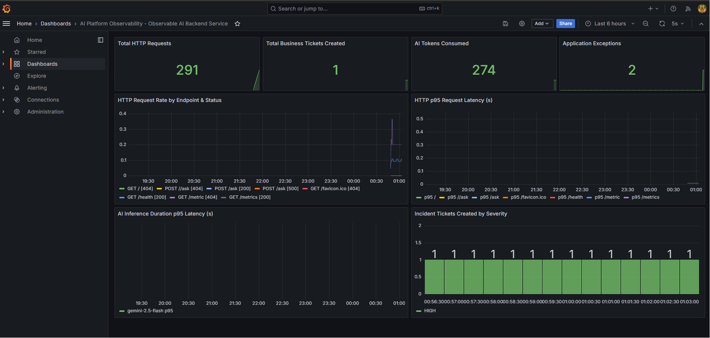
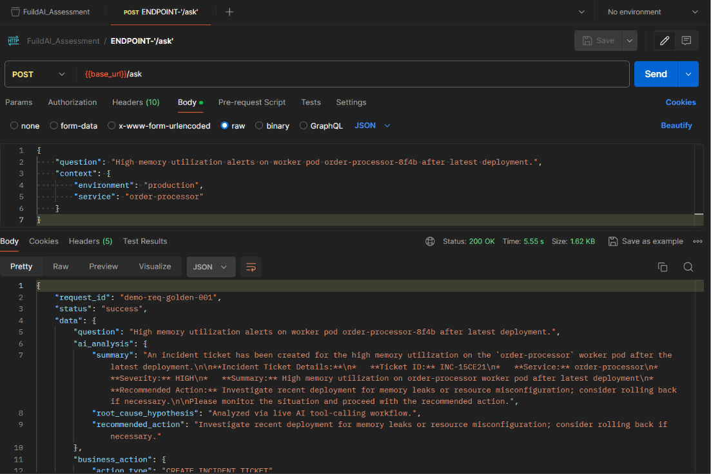
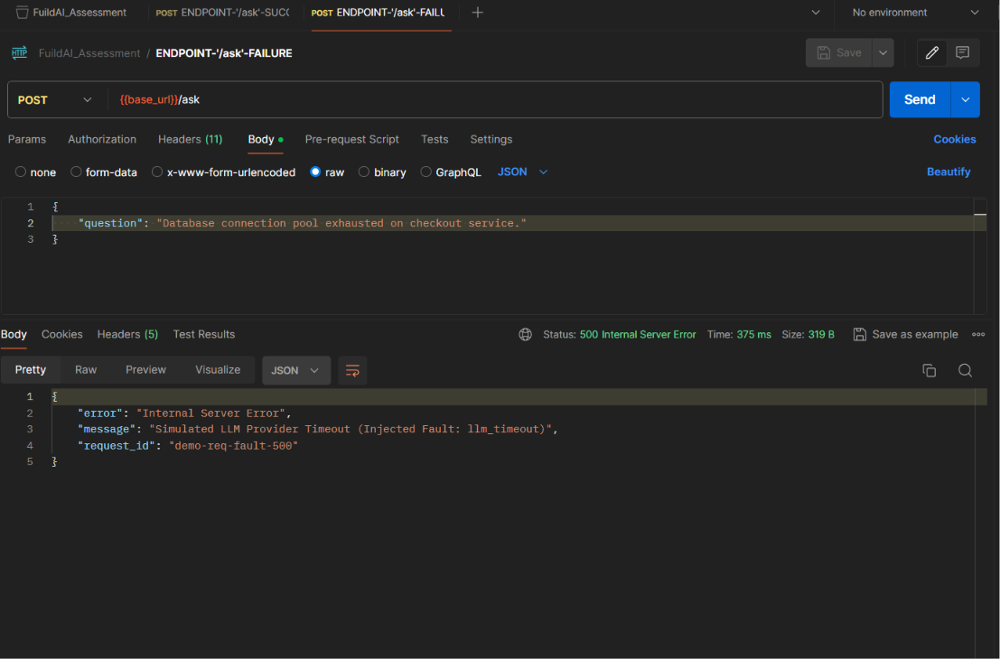

# Observable AI Backend Service

An observable, production-grade AI backend service built with **Python 3.11**, **FastAPI**, **Prometheus**, **Grafana**, and **structured JSON logging with end-to-end request correlation IDs (`X-Request-ID`)**. Built for the **AI Platform Engineer – Observability – 60-Minute Build Challenge**.

---

## Key Engineering & Observability Features

1. **Mandatory Real Engineering Improvement — Request Correlation + Dashboard-Ready Metrics:**
   - **End-to-end request correlation (`X-Request-ID`)**: every HTTP request is stamped with a correlation ID that propagates across async calls and into every JSON log line via Python `contextvars`.
   - Custom Prometheus metrics following the **RED** methodology (Rate, Errors, Duration), plus **AI token-utilization** and **business-action** counters for domain-level visibility.

2. **AI Workflow & Business Action:**
   - An **SRE/DevOps incident analyzer** that processes natural-language alerts and automatically triggers a business action (`create_incident_ticket`) when an issue needs mitigation.
   - Built on an OpenAI-SDK + Pydantic tool-calling loop supporting **Google Gemini** (`GEMINI_API_KEY`), **OpenRouter** (`OPENROUTER_API_KEY`), and **OpenAI** (`OPENAI_API_KEY`), with a **deterministic mock engine** for offline testing.

3. **One-Command Observability Stack:**
   - A full `docker-compose.yml` running **FastAPI**, **Prometheus (v2.51)**, and **Grafana (v10.4)** pre-loaded with an AI Service Observability dashboard.

---

## Quick Start

### 1. Configure Environment (`.env.local`)
Copy the template and populate any LLM API keys you want to use:
```bash
cp .env.example .env.local
```
```dotenv
GEMINI_API_KEY=your_gemini_api_key_here
OPENROUTER_API_KEY=your_openrouter_api_key_here
OPENAI_API_KEY=your_openai_api_key_here
FORCE_MOCK_MODE=false
```
> **Note:** `.env.local` is loaded by both local Python runs (`app.config`) and Docker Compose (`env_file`), and is excluded from Git via [`.gitignore`](./.gitignore). If no keys are set (or `FORCE_MOCK_MODE=true`), the service runs the deterministic mock engine — no external calls required.

### 2. Run via Docker Compose (recommended for the demo)
```bash
docker-compose up --build
```
- **FastAPI service:** `http://localhost:8002`
- **Prometheus metrics:** `http://localhost:8002/metrics`
- **Prometheus UI:** `http://localhost:9090`
- **Grafana dashboard:** `http://localhost:3002` (user: `admin` / password: `admin`)

### 3. Run the Test Suite
Tests are deterministic in mock mode. Force it explicitly so runs never depend on whether keys are present:
```bash
FORCE_MOCK_MODE=true pytest -v
```

### 4. API Testing with Postman
A pre-configured Postman collection is included:
- [`docs/FuildAI_Assessment.postman_collection.json`](./docs/FuildAI_Assessment.postman_collection.json)

Import it to exercise `/ask`, `/health`, and `/metrics` with pre-filled headers (`X-Request-ID`, `X-Inject-Fault`) and structured payloads.

---

## Observability Dashboard

The provisioned Grafana instance (`http://localhost:3002`) auto-loads the **AI Service Observability** dashboard visualizing RED metrics, LLM latency histograms, token usage, and business actions:



---

## Test Inputs & Demo Guide

### Scenario A — Successful Request (Golden Path)
```bash
curl -i -X POST http://localhost:8002/ask \
  -H "Content-Type: application/json" \
  -H "X-Request-ID: demo-req-golden-001" \
  -d '{
    "question": "High memory utilization alerts on worker pod order-processor-8f4b after latest deployment.",
    "context": {"environment": "production", "service": "order-processor"}
  }'
```
**Observability verification:**
- Returns `HTTP 200 OK` with header `X-Request-ID: demo-req-golden-001`.
- Structured JSON logs carry the same `request_id` across request start, AI inference, and ticket creation.
- Prometheus counter `business_actions_total{action_type="CREATE_INCIDENT_TICKET"}` increments.



---

### Scenario B — Fault-Injected Request (Incident Debugging)
```bash
curl -i -X POST http://localhost:8002/ask \
  -H "Content-Type: application/json" \
  -H "X-Request-ID: demo-req-fault-500" \
  -H "X-Inject-Fault: llm_timeout" \
  -d '{
    "question": "Database connection pool exhausted on checkout service."
  }'
```
**Observability verification:**
- Returns `HTTP 500 Internal Server Error` with header `X-Request-ID: demo-req-fault-500`.
- Structured error log includes the stacktrace tagged with the same `request_id`.
- Prometheus counter `app_exceptions_total{exception_type="TimeoutError"}` increments.



---

## Architecture Notes

- **Correlation:** `CorrelationIdMiddleware` reads an incoming `X-Request-ID` (or generates a UUID), stores it in `contextvars`, and echoes it on every response — including error responses.
- **Logging:** `StructuredJsonFormatter` emits one JSON object per log line, enriched with `request_id`, `event`, optional `duration_ms`, and `metadata` — ready for Loki/ELK/Datadog ingestion.
- **Metrics:** a dedicated `CollectorRegistry` exposes HTTP RED metrics, AI inference latency, token usage, business-action outcomes, and application exceptions at `/metrics`.
- **AI engine:** an OpenAI-SDK tool-calling loop with Pydantic-validated tool arguments (`CreateTicketToolInput`), a multi-provider client selector, and a deterministic mock fallback for CI and offline demos.
- **Fault injection:** the `X-Inject-Fault` header (`llm_timeout` / `llm_error`) forces failure paths so the failure demo and error metrics are reproducible.

---

## Project Structure
```text
assessment/
├── DESIGN.md                          # Architecture & tradeoff documentation
├── pyproject.toml                     # Project config & dependencies
├── Dockerfile                         # Production container build
├── docker-compose.yml                 # Local dev stack (hot-reload)
├── docker-compose.prod.yml            # Production deployment stack
├── .env.example                       # Environment template (copy to .env.local)
├── docs/
│   ├── FuildAI_Assessment.postman_collection.json  # Postman API collection
│   ├── screenshots/                   # Demo screenshots & Grafana dashboard
│   └── local-docs/                    # Planning notes, video script, reference notebook
├── app/
│   ├── main.py                        # FastAPI endpoints (/ask, /health, /metrics)
│   ├── config.py                      # Multi-provider settings & env config
│   ├── context.py                     # contextvars for request_id & fault injection
│   ├── middleware/correlation.py      # X-Request-ID correlation middleware
│   ├── observability/
│   │   ├── logger.py                  # Structured JSON logging formatter
│   │   └── metrics.py                 # Prometheus custom metrics registry
│   ├── schemas/                       # Pydantic schemas (API + AI tool calling)
│   └── services/                      # AI tool-calling engine + ticket business action
├── observability/
│   ├── prometheus.yml                 # Prometheus scrape config
│   └── grafana/                       # Auto-provisioned datasource & dashboard JSON
└── tests/
    └── test_api.py                    # Pytest verification suite
```